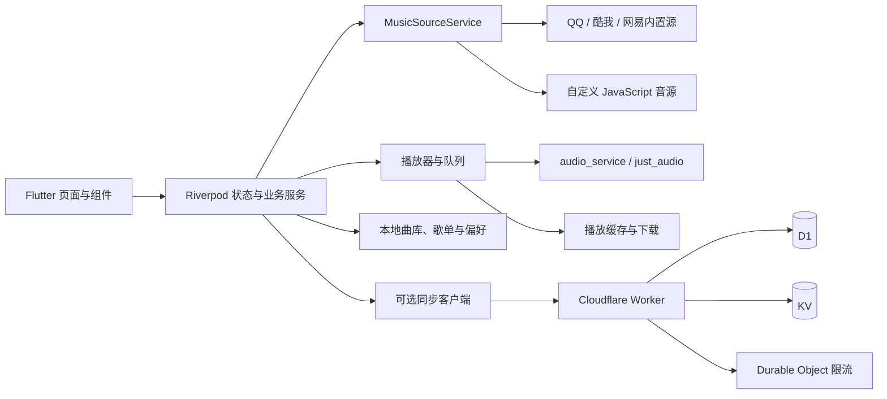

# Koyze

<p align="center">
  
</p>

<p align="center">
  面向 Android、Windows 与 iOS 的跨平台音乐查找、播放和本地曲库管理工具。
</p>

Koyze 使用 Flutter 构建，将 QQ 音乐、酷我音乐、网易云音乐、本地文件与自定义音源整合到同一套搜索和播放体验中。搜索、播放、下载、歌单和本地曲库均可在不登录、不部署服务端的情况下使用；Cloudflare Workers 后端只负责可选的账号与跨设备同步。

> [!IMPORTANT]
> 本项目仅用于技术研究和个人学习。请遵守所在地法律、平台服务条款与内容版权要求，不要将它用于侵犯版权或绕过付费授权。

## 功能

### 搜索与音源

- 聚合搜索 QQ 音乐、酷我音乐和网易云音乐，也可只搜索指定平台。
- 同时检索本地曲库与收藏，支持搜索历史、热门搜索和分页加载。
- 播放地址不可用时，可在多个平台与较低音质间继续尝试。
- 支持导入 LX Music 格式的 JavaScript 自定义音源，并提供启用、编辑、导出和运行日志。
- 可从 QQ 音乐、酷我音乐和网易云音乐的歌单链接或数字 ID 导入公开歌单，无需登录对应平台。

### 播放与歌词

- 基于 `just_audio` 与 `audio_service`，支持后台播放、媒体通知和系统媒体控制。
- 支持顺序播放、随机播放、单曲循环、播放队列、进度拖动与前后 10 秒跳转。
- 自动预取后续歌曲并保存播放会话，可按设置在下次启动时恢复。
- 支持 LRC、逐字歌词、翻译歌词、腾讯 QRC 与网易 YRC，逐字歌词可显示 KTV 填充效果。
- 提供 128 kbps、320 kbps、FLAC、FLAC 24-bit 和 Hi-Res 目标音质；界面显示最终实际使用的平台与音质。
- 支持 10、15、30、60、90 分钟睡眠定时。

> [!NOTE]
> 音质选项代表目标音质。若当前来源没有对应资源，Koyze 会自动尝试较低音质或其他平台，因此实际音质可能不同。

### 本地曲库与下载

- 递归扫描本地目录，并增量更新曲库。
- 支持 MP3、FLAC、M4A、AAC、WAV、OGG、Opus、WMA、APE、AIFF 和 ALAC。
- 读取歌曲标签与封面；缺少标签时可从文件名推断基本信息。
- Android 支持 MediaStore、系统目录授权（SAF）和从其他应用打开音频文件。
- iOS 支持通过系统文件选择器授权目录访问。
- 可在线匹配本地歌曲的元数据、封面与歌词，并提供实验性的标签写入功能。
- 下载任务支持并发、暂停、继续、重试、取消、进度与速度显示，以及仅 Wi-Fi 下载策略。
- 下载完成的歌曲会自动加入本地曲库；播放缓存也可复用于下载。

### 歌单、统计与推荐

- 内置“我的收藏”“最近播放”和“本地音乐”，并支持创建自定义歌单。
- 支持歌单内搜索、排序、拖动重排、批量收藏和重复歌曲检测清理。
- 可导入或导出 JSON 备份；恢复过程带事务回滚，避免只写入部分数据。
- 提供周、月、年和全部时间范围的播放统计，包括播放次数、时长、活跃天数、歌曲/歌手/专辑排行与每日趋势。
- 根据收藏和播放记录在本地建立偏好画像，再从在线音源生成推荐结果。

> [!NOTE]
> 推荐功能需要至少 100 首收藏歌曲，推荐结果会缓存 12 小时。

### 可选云同步

- Cloudflare Workers + D1 + KV + Durable Objects 后端。
- 支持账号注册、登录、修改密码和会话失效管理。
- 可同步收藏、自定义歌单、评分、部分设置与自定义音源定义。
- 搜索、播放、歌词和媒体文件不经过该后端；未配置服务器时，核心功能仍可正常使用。
- 自定义音源的启用状态仅保存在当前设备，不参与同步。

## 平台支持

| 平台 | 最低要求 | 平台能力与注意事项 |
| --- | --- | --- |
| Android | 由当前 Flutter 工具链支持的 Android 版本 | 后台播放、媒体通知、MediaStore、SAF 目录授权、音频文件打开与下载 |
| Windows | Windows 10/11 x64 | 本地曲库、系统托盘、关闭窗口时退出/隐藏选择、可选便携数据模式 |
| iOS | iOS 13.0 | 后台音频与文件目录授权；桌面小组件、Live Activity 和灵动岛需要 iOS 16.1 及正确签名 |

当前仓库不包含 Web、macOS 或 Linux 目标。

## 快速开始

### 环境要求

- Flutter `3.44.0` 或更高版本；持续集成使用 Flutter `3.44.9`。
- Dart `3.12.0` 或更高版本（随 Flutter 提供）。
- Android：Android Studio/SDK 与 JDK 17。
- Windows：Visual Studio 2022，并安装“使用 C++ 的桌面开发”。
- iOS：macOS、Xcode 与 CocoaPods。

### 运行应用

```bash
git clone https://github.com/kiseding/Koyze.git
cd Koyze
flutter pub get
flutter run
```

如果连接了多个设备，可先查看设备 ID：

```bash
flutter devices
flutter run -d <device-id>
```

首次启动时可以跳过登录。进入“设置”后可调整默认搜索平台、播放/下载音质、缓存、下载策略、本地目录和自定义音源。

## 构建发行版

### Android

调试 APK：

```bash
flutter build apk --debug
```

Release 构建必须配置签名。在 `android/key.properties` 中填写：

```properties
storeFile=release.jks
storePassword=your-store-password
keyAlias=your-key-alias
keyPassword=your-key-password
```

将密钥文件放在与 `storeFile` 对应的位置，然后执行：

```bash
flutter build apk --release --split-per-abi
flutter build appbundle --release
```

### Windows

```bash
flutter build windows --release
```

输出位于 `build/windows/x64/runner/Release/`。发布时需要保留该目录内的 DLL、数据文件和可执行文件，不能只复制 `Koyze.exe`。

#### 便携数据模式

在 `Koyze.exe` 同级目录创建一个名为 `portable.flag` 的空文件，应用会将配置、曲库索引、下载记录和缓存写入同级的 `portable_data/`，而不是用户配置目录。

> [!TIP]
> GitHub Actions 生成的 Windows ZIP 是免安装压缩包，但默认仍使用用户配置目录。需要数据也随目录移动时，请自行添加 `portable.flag`。

### iOS

```bash
cd ios
pod install
cd ..
flutter build ios --release
```

需要在 Xcode 中为主应用和 Widget Extension 配置开发团队、Bundle ID、App Group 以及签名。只验证编译而不签名时可以使用：

```bash
flutter build ios --release --no-codesign
```

## 自定义音源

在“设置 → 自定义音源”中可通过以下方式导入：

- 选择本地 `.js` 文件（最大 2 MiB）。
- 粘贴 LX Music 格式脚本或 Koyze 导出的 JSON 配置。
- 填写 HTTPS 直链下载脚本。

脚本可声明支持的平台、操作和音质。Koyze 同一时间只启用一个自定义音源，启用新音源会停用原音源。

> [!WARNING]
> 自定义音源是可执行 JavaScript。应用会进行格式检查、超时和部分危险模式检测，但这不是安全沙箱，脚本仍可发起网络请求。只导入来源可信、内容经过审查的脚本。

## 部署可选同步服务

不需要跨设备同步时，可以跳过本节。

### 准备资源

后端位于 `workers/`，要求 Node.js 20 或更高版本、Cloudflare 账号和 Wrangler 登录状态。

```bash
cd workers
npm ci
npx wrangler login
npx wrangler d1 create koyze-api
npx wrangler kv namespace create CACHE
```

将命令返回的 D1 `database_id` 和 KV `id` 填入 `workers/wrangler.toml` 对应占位项，然后执行数据库迁移：

```bash
npx wrangler d1 migrations apply koyze-api --remote
```

### 手动部署与 Worker 密钥

```bash
npm run deploy
npx wrangler secret put ADMIN_USERNAME
npx wrangler secret put ADMIN_PASSWORD
```

可选的第三方接口密钥：

```bash
npx wrangler secret put TINYAPI_KEY
```

请在首次注册或登录前设置管理员账号与密码。部署完成后检查：

```bash
curl https://<your-worker>.workers.dev/api/health
```

然后在 Koyze 的“设置 → 同步”中填写该 HTTPS 地址。登录令牌会保存在系统安全存储中，并按服务器来源隔离。

### 使用 GitHub Actions 自动部署

仓库内的 `.github/workflows/deploy-workers.yml` 会在以下情况运行：

- `main` 分支中的 `workers/**` 或部署工作流本身发生变化。
- 在 GitHub 的“Actions → Deploy Workers API”页面手动选择“Run workflow”。

运行前，进入仓库的“Settings → Secrets and variables → Actions → Repository secrets”，添加以下 6 个 Secret：

| Repository Secret | 填写内容 | 用途 |
| --- | --- | --- |
| `CLOUDFLARE_API_TOKEN` | Cloudflare API Token | 远程执行 D1 迁移、部署 Worker 和写入 Worker Secret |
| `CLOUDFLARE_ACCOUNT_ID` | Worker 所属 Cloudflare 账号的 Account ID | 指定 Wrangler 操作的账号 |
| `D1_DATABASE_ID` | `npx wrangler d1 create koyze-api` 返回的数据库 UUID | 替换 `wrangler.toml` 中的 D1 占位符 |
| `KV_NAMESPACE_ID` | `npx wrangler kv namespace create CACHE` 返回的命名空间 ID | 替换 `wrangler.toml` 中的 KV 占位符 |
| `ADMIN_USERNAME` | 初始管理员用户名 | 部署后写入 Worker，并用于登录健康检查 |
| `ADMIN_PASSWORD` | 足够强的初始管理员密码 | 部署后写入 Worker，并用于登录健康检查 |

当前工作流不读取 GitHub Repository Variables，以上项目必须添加在 **Repository secrets**，不是 Variables。D1 和 KV 资源需要提前创建，填写的是资源 ID，不是 `koyze-api` 或 `CACHE` 这两个名称。

创建 `CLOUDFLARE_API_TOKEN` 时，可从 Cloudflare 的“Edit Cloudflare Workers”模板开始，并额外授予所选账号的 **D1 Edit** 权限；资源范围应尽量只包含实际部署账号。可参考 [Cloudflare GitHub Actions 指南](https://developers.cloudflare.com/workers/ci-cd/external-cicd/github-actions/) 与 [API Token 权限列表](https://developers.cloudflare.com/fundamentals/api/reference/permissions/)。

也可以使用 GitHub CLI 逐项设置，命令会安全地提示输入 Secret 内容：

```bash
gh secret set CLOUDFLARE_API_TOKEN
gh secret set CLOUDFLARE_ACCOUNT_ID
gh secret set D1_DATABASE_ID
gh secret set KV_NAMESPACE_ID
gh secret set ADMIN_USERNAME
gh secret set ADMIN_PASSWORD
```

配置完成后手动运行工作流。它会依次执行 Workers 类型检查与测试、把 D1/KV ID 注入临时的 `wrangler.toml`、应用远程迁移、部署 Worker、上传管理员凭据，并验证 `/api/health`、管理员登录和令牌校验。工作流中的占位符替换只发生在 Actions Runner 内，不会修改仓库文件。

> [!NOTE]
> 当前 Actions 工作流不会读取或上传 `TINYAPI_KEY`。需要该可选密钥时，请在首次部署后本地执行 `npx wrangler secret put TINYAPI_KEY`，或者自行扩展部署工作流。

> [!WARNING]
> 如果复用旧版 D1，且已有 `users` 表缺少 `token_version` 字段，工作流会主动停止，不会继续部署。请先备份数据库并完成对应的一次性结构迁移，再重新运行 Actions；全新数据库不受影响。

### 本地调试 Workers

在 `workers/.dev.vars` 中配置本地密钥（该文件已被 Git 忽略）：

```dotenv
ADMIN_USERNAME=admin
ADMIN_PASSWORD=replace-with-a-strong-password
```

初始化本地 D1 并启动开发服务器：

```bash
cd workers
npm ci
npx wrangler d1 migrations apply koyze-api --local
npm run dev
```

后端包含登录与注册限流、PBKDF2-SHA256 密码派生、7 天 HS256 会话令牌、令牌版本失效、增量事件同步与快照同步。生产环境请使用足够强的管理员密码，并妥善保管 Cloudflare 密钥。

## 项目结构

```text
Koyze/
├─ lib/
│  ├─ core/                 # 通用模型、服务、主题与基础组件
│  ├─ features/             # 搜索、播放、歌单、本地曲库、下载、同步等功能
│  └─ router/               # go_router 路由
├─ test/                    # Flutter 单元、组件与服务测试
├─ android/                 # Android 原生配置与桥接
├─ ios/                     # iOS 主应用、Widget 与 Live Activity
├─ windows/                 # Windows Runner、系统托盘与便携模式
├─ workers/                 # Cloudflare Workers 同步后端、迁移与测试
├─ third_party/             # 仓库内使用的第三方源码
└─ .github/workflows/       # 分析、测试、构建、发布与后端部署
```

核心数据流：



## 开发与测试

Flutter 静态检查和不依赖外部网络的测试：

```bash
flutter analyze --no-fatal-infos
flutter test --exclude-tags live
```

带 `live` 标签的测试会访问真实音乐平台接口，容易受网络、地区限制和第三方接口变化影响，请按需单独运行：

```bash
flutter test --tags live
```

Workers 的测试、TypeScript 类型检查和批处理结构检查：

```bash
cd workers
npm ci
npm run validate
```

Pull Request 持续集成会执行 Flutter 分析、确定性测试和 Workers 校验。推送到主分支或版本标签时，工作流还会构建 Android、Windows 和 iOS 产物；正式 Android 产物需要在仓库 Secrets 中提供签名材料。

## 数据与隐私说明

- 本地歌单、搜索历史、播放记录、下载记录、曲库索引与多数设置默认保存在设备上。
- 云同步是可选能力，不会代理搜索请求、播放地址、歌词或媒体文件。
- JSON 备份可能包含歌单、自定义音源和设置，分享前请检查其中是否有不希望公开的信息。
- 清除缓存不会等同于删除下载；退出云账号也不会自动删除本地曲库和歌单。

## 常见问题

**必须部署 Workers 才能使用吗？** 不需要。只有账号与跨设备同步依赖 Workers；音乐搜索、播放、歌词、本地曲库、歌单和下载均可独立使用。

**为什么选择无损后最终播放的是较低音质？** 目标平台可能没有该音质，链接也可能暂时失效。Koyze 会继续尝试较低音质或其他平台，并在播放器中显示最终实际音质。

**为什么推荐页面没有结果？** 需要至少 100 首收藏歌曲才能建立偏好画像。收藏达到要求后重新生成即可。

**Windows 压缩包为什么没有把数据放在应用目录？** 免安装与便携数据模式是两回事。请在 `Koyze.exe` 同级创建 `portable.flag` 后再启动应用。

## 许可证

仓库根目录目前没有提供开源许可证。公开可见不等于自动获得复制、修改、分发或商业使用授权；如需复用代码，请先取得版权所有者许可。`third_party/` 中的组件按其各自许可证执行。
